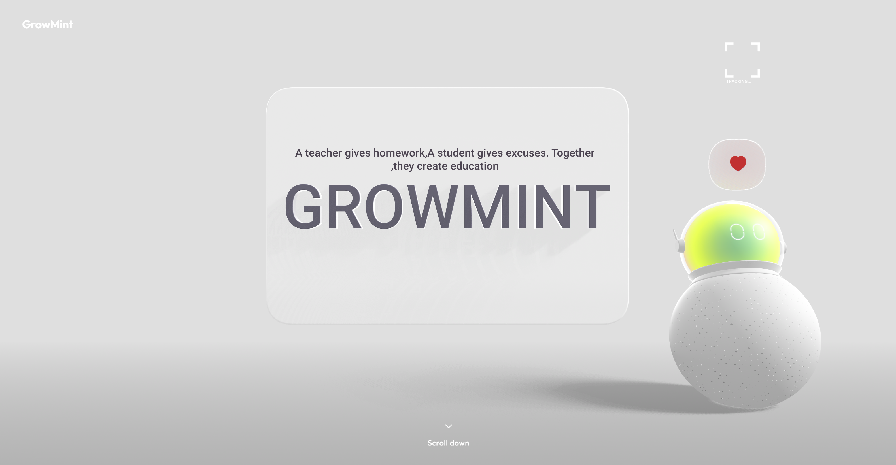

# GrowMint — AI-Resistant EdTech Platform



> *"A teacher gives homework. A student gives excuses. Together, they create education."*

GrowMint is a full-stack educational platform that fights AI-assisted academic dishonesty using **RAG-generated logic-trap assignments**, **Zero-Knowledge Proof of human authorship**, and a **cryptographic skill portfolio** that replaces the traditional resume.

---

## Features

### For Educators
- **RAG Curriculum Engine** — Upload lecture PDFs/notes, pick a topic, and Gemini generates an assignment with a course-specific logic trap that LLMs cannot solve without the actual material
- **Bulk Class Analysis** — Upload a ZIP of student submissions and get AI-powered grading, plagiarism detection, and per-student integrity reports
- **Submission Review** — Inspect each student's ZK telemetry proof, keystroke analytics, and voice explanation

### For Students
- **Secure Code Editor** — Keystroke telemetry tracks every keydown and paste event with timestamps
- **ZK Proof of Human Thought** — Typing rhythm variance, backspace ratio, and paste detection produce a human score (0–100) and a cryptographic proof hash
- **Voice Explanation** — Record a spoken walkthrough; transcript is analyzed for keyword overlap with the assignment
- **ZK SkillGraph** — Interactive force-directed graph of verified skills, each backed by a proof hash
- **Company Project Verification** — Upload a project ZIP + description and get an AI-verified certificate of authenticity
- **Team Architect** — Contribution scoring for group projects based on code dependency graphs, line counts, and module ownership

---

## Tech Stack

| Layer | Technology |
|---|---|
| Frontend | React 19, Vite 8, React Router v7 |
| Styling | Custom CSS design system |
| Graph viz | react-force-graph-2d |
| Icons | lucide-react |
| Backend | FastAPI (Python) |
| AI | Google Gemini 2.5 Flash |
| PDF parsing | pypdf |
| Auth | Client-side context + localStorage (demo) |

---

## Project Structure

```
growmint/
├── frontend/               # React + Vite app
│   ├── src/
│   │   ├── components/     # Layout, Sidebar, Badge, KeystrokeReplay
│   │   ├── context/        # AuthContext
│   │   ├── pages/          # All route pages
│   │   └── utils/          # API clients, ZK simulator, mock data
│   └── public/
│       └── coder-frames/   # Animation frames
│
└── backend/                # FastAPI server
    ├── main.py             # All API endpoints
    ├── bulk_analyzer.py    # ZIP submission analysis
    ├── team_architect.py   # Contribution scoring engine
    └── requirements.txt
```

---

## Getting Started

### Backend

```bash
cd backend

# Create and activate virtual environment
python -m venv venv
venv\Scripts\activate        # Windows
# source venv/bin/activate   # macOS/Linux

# Install dependencies
pip install -r requirements.txt

# Add your Gemini API key
cp .env.example .env
# Edit .env and set GEMINI_API_KEY=your_key_here

# Start the server
uvicorn main:app --reload
# Runs at http://127.0.0.1:8000
```

### Frontend

```bash
cd frontend

npm install
npm run dev
# Runs at http://localhost:5173
```

---

## API Endpoints

| Method | Endpoint | Description |
|---|---|---|
| GET | `/health` | Health check |
| POST | `/rag/generate` | Generate assignment from lecture files |
| POST | `/submissions/analyze-zip` | Bulk grade student submissions |
| POST | `/company/verify` | Verify project ZIP against description |
| POST | `/team/project/create` | Create team project |
| POST | `/team/project/{id}/member/add` | Add team member |
| POST | `/team/project/{id}/upload` | Upload code file |
| POST | `/team/project/{id}/analyze` | Compute contribution scores |
| GET | `/team/project/{id}` | Get project details |

---

## Environment Variables

**backend/.env**
```
GEMINI_API_KEY=your_gemini_api_key_here
```

The app works without a Gemini key — every endpoint falls back to local heuristics automatically.

---

## Demo Accounts

The login accepts any email/password and sets a hardcoded demo user:

| Role | Name | Navigate to |
|---|---|---|
| Student | Aarav Sharma | `/student/dashboard` |
| Educator | Prof. Kabir | `/teacher/dashboard` |

Use the **Switch Role** button in the sidebar to toggle between them.

---

## License

MIT
